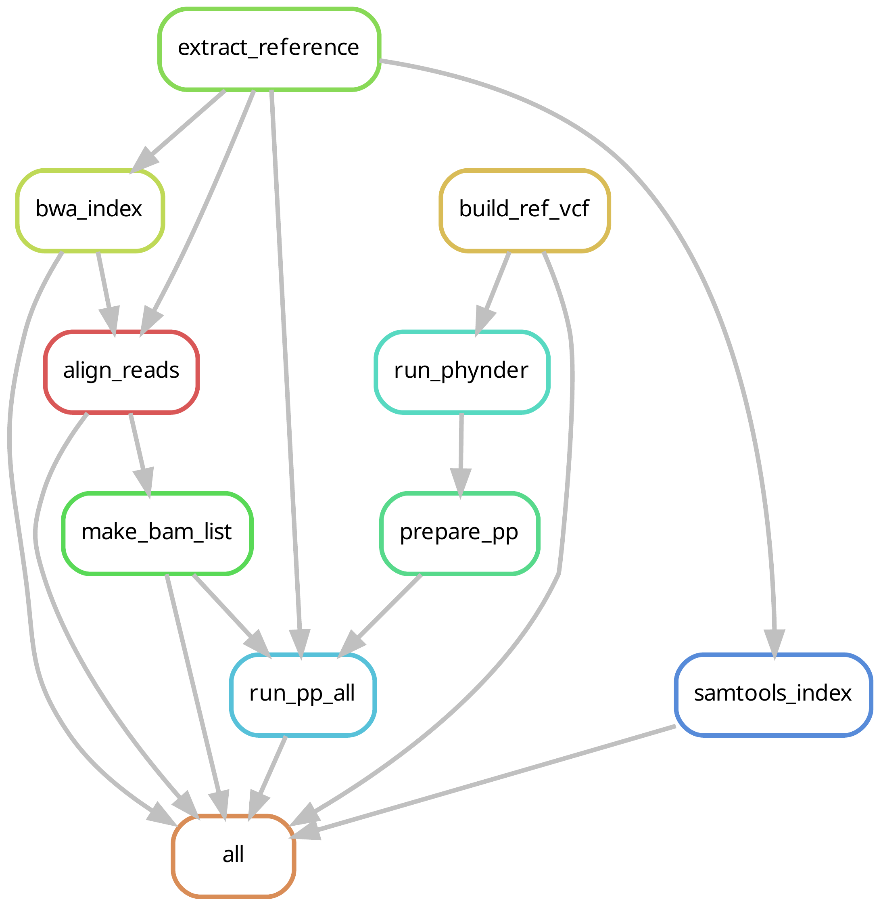
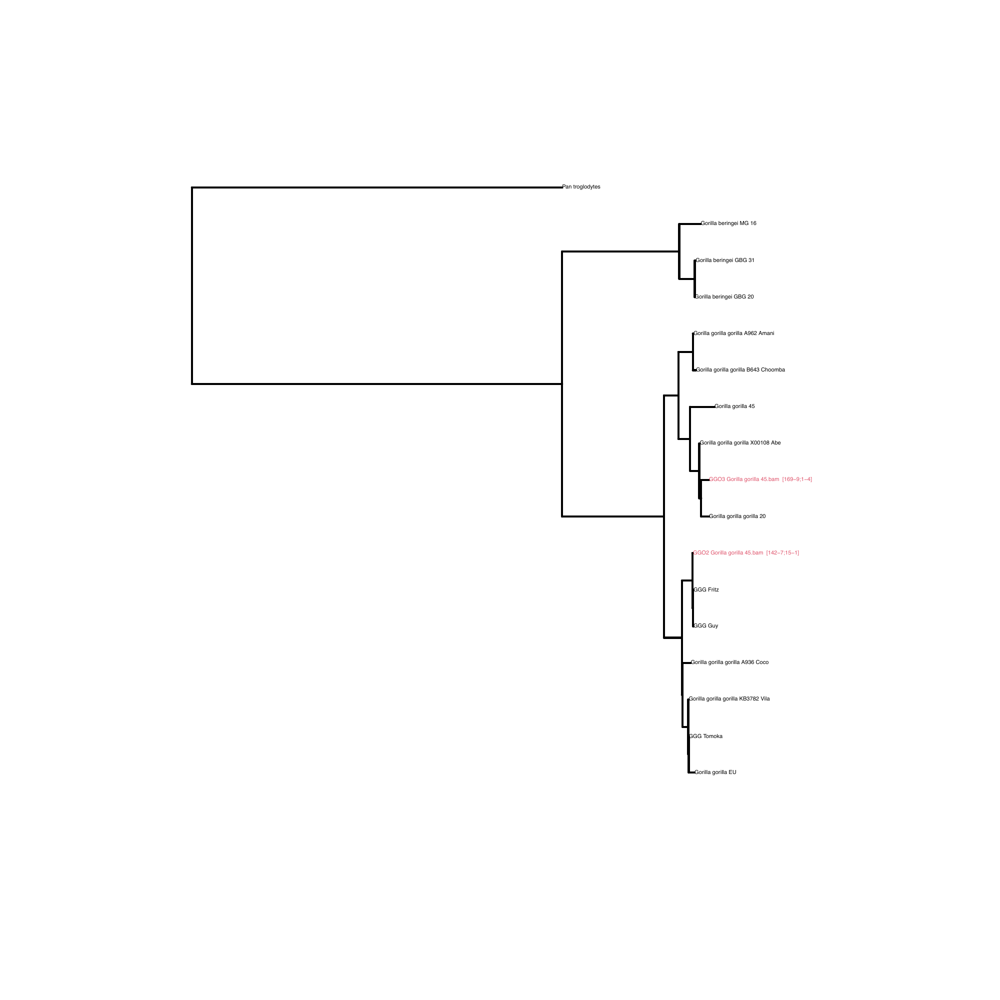

# Primates_MtKit Snakemake Pipeline

This repository contains a Snakemake-based pipeline to process ~low-quality mtDNA reads and use them to map a sample in the known diversity of its group.

## Required files

- `config.yaml` - pipeline configuration
- per-dataset samples file, e.g. `data/gorillas_samples.txt` and `data/papio_samples.txt`
  - each line must contain:
    - sample FASTQ path
    - sample name
    - comma-separated reference IDs - you can use more references in case you don't know which may be the best
- per-dataset MSA file and tree defined in `config.yaml`

It is important to note that datasets should not go too deep, for example, the `primates` dataset is kind of doomed to fail, whereas the gorilla one is more useful. Therefore, the reference MSA and tree should cover a bit the diversity of the species you may be interested in.




## Example config structure

```yaml
datasets:
  gorillas:
    refs: data/gorillas_samples.txt
    msa: data/references/mts_gorilla_aln.fa
    tree: data/references/mts_gorilla_rooted.nwk

  papio:
    refs: data/papio_samples.txt
    msa: data/references/mts_papio_aln.fa
    tree: data/references/mts_papio_rooted.nwk
```

## Usage

From the repository root:

```bash
snakemake -j 4 --sdm conda
```

Add `-n` if you want to do a dry run. 
Most of the software is handled by conda, you need to have [snakemake](https://snakemake.readthedocs.io/en/stable/getting_started/installation.html) and R (and maybe some packages installed)


## Example output

For example, in the Gorilla dataset we manage to place the sample GGO2 in the gorilla diversity with Fritz and Guy, 


